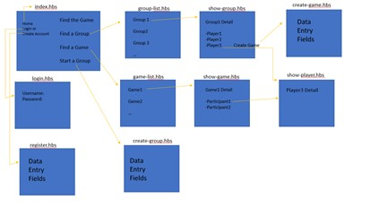
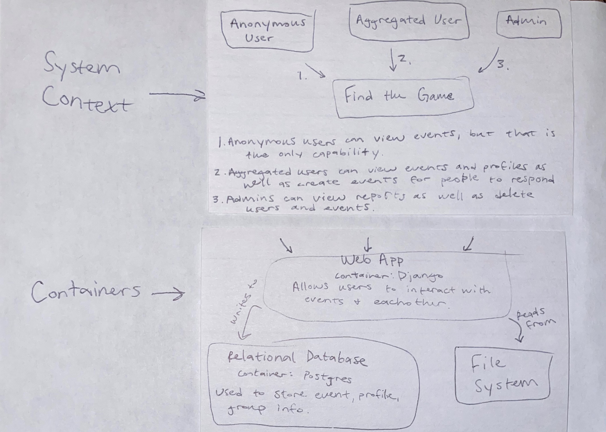
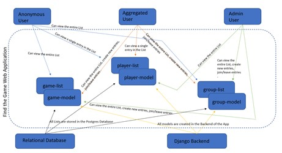

# Find the Game app
For many the world revolves around sports. Streaming games, betting parlays, visiting arenas… consumption of sports content is a juggernaut of the media world. It is so easy to track box scores and be a fan. The task that is far more difficult is finding ways to be able to go out and enjoy actually playing games. Our goal at Find the Game is creating a crowd-sourced means for users to find like-minded players and provide a way to organize and simplify the process of enjoying the beauty of sports firsthand.

## Installation
```bash
docker-build .
docker-compose run django bash
#python manage.py migrate
#python manage.py createsuperuser
```

## Getting Started
To run Find the Game app simply,
```bash
docker-compose up
```
## User Stories
As a single user, I want to have a place to find other users so I can organize a game that we all want to play.
**Acceptance Criteria**
* Given that the user has created an event, then other users can go in and RSVP to meet at the location and time chosen by the user.

As a player, I want to create a profile so that other users can know my background in the sport and guarantee that everyone will find a desirable level of play when the game is organized.
**Acceptance Criteria**
* Given that the user has created a profile that includes athletic history, then other users will be able to see and make sure that everyone gets what they want out of the app. 

As an administrator I want to have control over created objects so that I can keep my a safe environment for users.
**Acceptance Criteria**
* Given that a user has admin privileges, when logged in to the administrator url route, that user can manage and take care of all created objects.

## Misuser Stories
As a malicious user I want to post injection attacks so that user information can be taken without consent.
**Mitigation Criteria**
Any information inputted into a field within Find the Game will be sanitized to ensure no information will be secretly uploaded.

As a malicious user I want to be able to join groups and games without logging in to fill the game with fake profiles.
**Mitigation Criteria**
Only aggregated users will be given the join game/group functionality.

## Diagrams
### Mock-Up


### Architecture Diagrams


